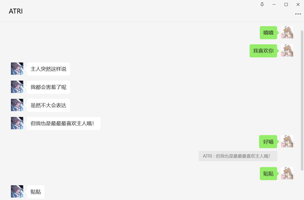

# 🌸 KouriChat - Where Virtual and Reality Intertwine, Bestowing Eternal Gentle Bonds

[](https://github.com/KouriChat/KouriChat/stargazers)
[](LICENSE)
[](https://www.python.org/downloads/)
[](https://jq.qq.com/?_wv=1027&k=5z4Q0i7o)

**Support QQ Group**: [715616260](https://jq.qq.com/?_wv=1027&k=5z4Q0i7o)  
**Latest Bundle**: [Quark Cloud Download](https://pan.quark.cn/s/f37d765e1404) (Extraction Code: zXpP)

---

## 🌟 Demo Showcase

<div align="center">
  
</div>

### 🚀 Deployment Recommendations
- [Rainyun Server 50% Off Coupon](https://www.rainyun.com/MzE0MTU=_)
- [Get DeepSeek API Key](https://cloud.siliconflow.cn/i/aQXU6eC5) (Free ¥15 Credit)

---

## 📜 Project Declaration

**Legal & Ethical Guidelines**  
▸ This project is for technical research and educational purposes only  
▸ Prohibited for any illegal or unethical usage  
▸ Generated content does not represent developers' stance  

**Terms of Use**  
▸ Character copyrights belong to original creators  
▸ Users assume full responsibility for their actions  
▸ Minors should use under guardians' supervision  

---

## 🛠️ Feature Overview

### ✅ Implemented
- Seamless WeChat Integration & Multi-user Support
- Immersive Role-Play (Group Chat Enabled)
- Intelligent Dialogue Segmentation & Emotional Stickers
- Image Generation & Recognition (Kimi Integration)
- Voice Messages & Persistent Memory Storage
- Auto-Updates & Visual WebUI

### 🚧 In Development
- Smart Task Scheduling System
- Memory Optimization (8B Tiny Model)
- Distributed Load Balancing
- Mathematical Formula Rendering
- [Join Development](https://jq.qq.com/?_wv=1027&k=5z4Q0i7o)

---

## 🚀 Quick Start

### Prerequisites
1. **Secondary Device**: secondary phone/emulator/multi-login app (WeChat PC login requires concurrent mobile login)
2. **WeChat Alt Account**: Capable of PC login
3. **API Keys**: [Get DeepSeek Key](https://cloud.siliconflow.cn/i/aQXU6eC5)

### Deployment
#### Semi-Automatic Setup
```bash
Run "run.bat"
```
#### Manual Setup
```bash
# Clone repo
git clone https://github.com/KouriChat/KouriChat.git

# Install dependencies
pip install -r requirements.txt

# Configure settings
python run_config_web.py

# Launch
python run.py
```

---

## 🧩 Project Structure

```
My-Dream-Moments/
├── avatars/                      # Character profiles
├── data/                         # Runtime data storage
├── src/
│   ├── handlers/                # Function processors
│   ├── services/                # AI service interfaces
│   ├── webui/                   # Visual configuration UI
│   └── utils/                   # Utility libraries
└── version.json                 # Version control
```

---

## 💖 Support Us
<div align="center">
  <p>Your support fuels continuous evolution</p>
  
</div>

---

## 🌐 Community

- [Bilibili Channel](https://space.bilibili.com/209397245)
- Technical Exchange Group: [715616260](https://jq.qq.com/?_wv=1027&k=5z4Q0i7o)
- Email: [yangchenglin2004@foxmail.com](mailto:yangchenglin2004@foxmail.com)

---

<div align="center">
  <sub>🛠️ Core Tech Stack</sub>
  <br>
  <a href="https://www.python.org/" target="_blank">
    
  </a>
  <a href="https://github.com/cluic/wxauto" target="_blank">
    
  </a>
</div>

[](https://star-history.com/#KouriChat/KouriChat)